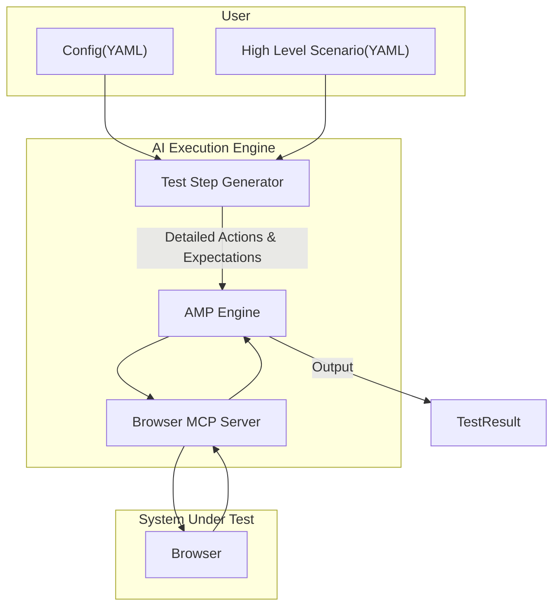

## To Run

```
mv .env.example .env
set 'OPENAI_API_KEY' to .env file
./setup.sh 
python src/main.py 
```



### Website to Practice UI Automation 
- https://www.saucedemo.com
- https://the-internet.herokuapp.com
- https://practice-automation.com
- http://www.uitestingplayground.com
- https://qa-practice.netlify.app
- https://weathershopper.pythonanywhere.com
